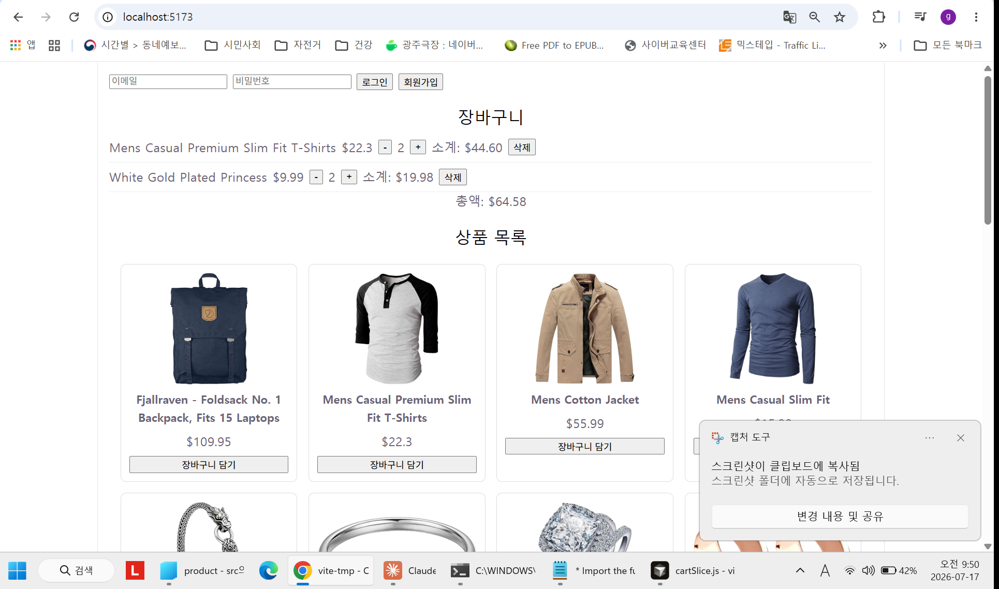
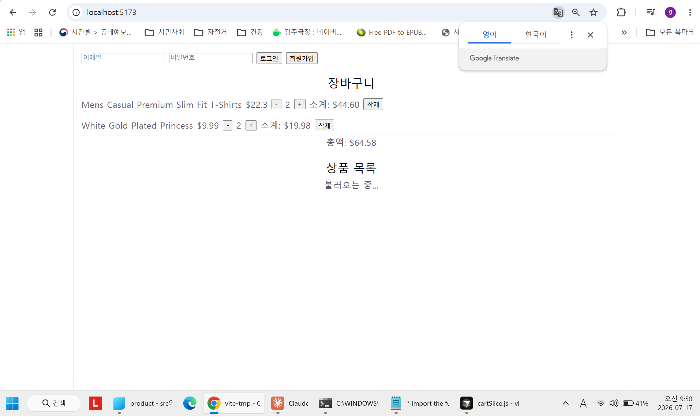
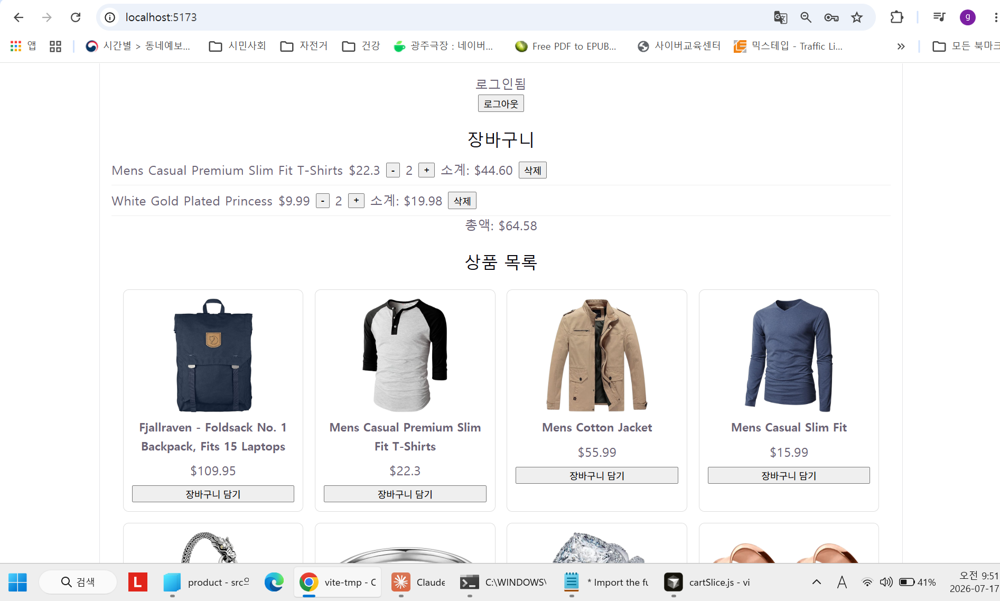
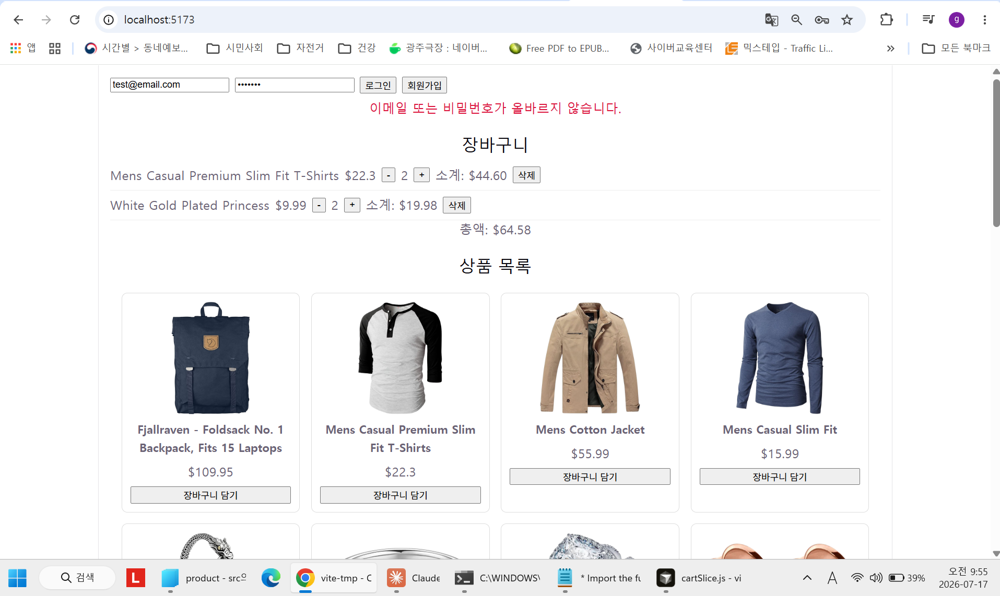
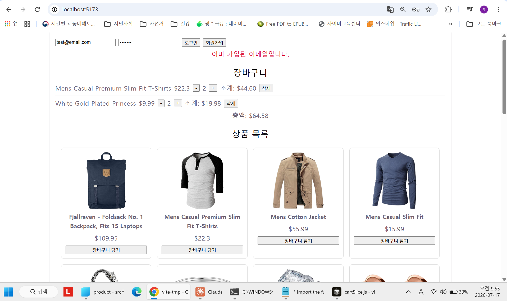
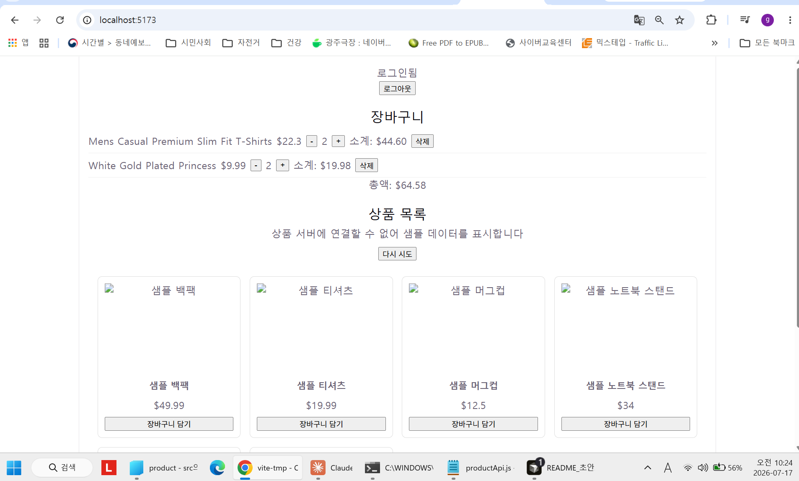

# 과제 6. React 쇼핑몰 앱 만들기

## 1. 과제 소개

| 항목 | 내용 |
|---|---|
| 과정명 | AI SW 장기교육 |
| 선수 강의 | 따라하며 배우는 리액트 A-Z |
| 핵심 기술 | React, 전역 상태관리(Redux Toolkit), Firebase Authentication |
| 상품 데이터 | Fake Store API + 장애 시 동일 스키마 mock 대체 |
| 선택 기술 | TypeScript (미적용, JavaScript 사용) |
| 결과 예시 | https://drive.google.com/file/d/1fUeCYpSu0H_BU154iN7t1IHM37cDo6mz/view?usp=sharing |

### 한 줄 소개

> 이 프로젝트는 로그인 없이도 상품을 담을 수 있고, 사용자가 상품을 조회하고 Firebase로 로그인하며, 원하는 상품을 전역 장바구니에 담아 예상 총액을 확인할 수 있는 React 쇼핑몰입니다.

### 결과 예시와 다른 점

- 참고한 기능 흐름: 상품 목록 → 담기 → 장바구니·총액 → 로그인의 기본 흐름
- 다르게 설계한 UI·기능: 결과 예시보다 화면 구성을 단순화 (한 페이지 배치, 최소 스타일). 대신 정책·상태 설계에 집중 — 비로그인 담기 허용, 로그아웃 후 cart 유지, LocalStorage 저장·복원, mock 전환 안내 + 다시 시도 버튼
- 복제하지 않은 이미지·브랜드·문구: 결과 예시의 화면 디자인·이미지·문구를 복제하지 않음. mock 상품명도 "샘플 백팩" 등 일반 명칭으로 직접 작성 (Fake Store API 상품명 미복제)

## 2. 실행 화면

| 화면 | 파일·링크 | 설명 |
|---|---|---|
| 상품 목록·비로그인 | ./screenshots/products.png | 상품 카드 그리드 + 비로그인 폼 + 장바구니 동시 표시 |
| 로딩 상태 | ./screenshots/loading.png | 상품 "불러오는 중..." 표시 (장바구니는 LocalStorage 복원으로 즉시 표시) |
| 로그인 상태 | ./screenshots/auth_logged_in.png | "로그인됨" + 로그아웃 버튼 (이메일·uid 미노출) |
| 로그인 실패 안내 | ./screenshots/auth_error_login.png | 틀린 비밀번호 → "이메일 또는 비밀번호가 올바르지 않습니다." |
| 회원가입 오류 안내 | ./screenshots/auth_error_signup.png | 중복 가입 시도 → "이미 가입된 이메일입니다." |
| 오류·mock 대체 | ./screenshots/mock_fallback_retry.png | API 실패 안내 + "다시 시도" 버튼 + mock 6개 동일 UI (장바구니 유지 확인) |

```md






```

### 실시간 응시와 최종 보완 비교

| 항목 | 1시간 종료 시 | 최종 제출 시 | 보완 내용 |
|---|---|---|---|
| 데이터·상태·인증 설계 | product/cartItem/authUser 구조·정책 확정 | 동일 (변경 없음) | — |
| 전역 장바구니 | Redux store + cartSlice + LocalStorage 동기화 완성 | 동일 + 총액 표시 포맷 수정 | 부동소수점 오차 toFixed(2) 처리 |
| Firebase 인증 | 로그인·회원가입·로그아웃·3상태 완성 | 동일 (변경 없음) | — |
| 상품 API·대체 경로 | API 연동·loading/error/empty 완성 | mock 대체 경로 추가 | isMock 플래그 + 안내 문구 + 동일 스키마 mock 6개 |
| README·테스트 | 미작성 | 작성 완료 | 템플릿 기반 작성, 테스트 8건 수행 |

## 3. 구현 기능

### 필수 기능

| 기능 | 상태 | 확인 방법 | 비고 |
|---|---|---|---|
| 상품 데이터 조회 또는 mock 대체 | ■ 완료 | 정상 시 API 20개 / URL 변조 테스트로 mock 6개 확인 | isMock 플래그로 경로 구분 |
| loading·error·empty | ■ 완료 | 새로고침 시 "불러오는 중...", 실패 시 안내+mock | 앱 중단 없음 |
| 상품 목록·카드 | ■ 완료 | 상품명·가격·이미지·담기 버튼, 이미지 실패 대체 | 그리드 배치 |
| 전역 상태관리 라이브러리 | ■ 완료 | Redux Toolkit + React Redux | store/Provider 연결 |
| 장바구니 담기·목록 | ■ 완료 | ProductCard에서 dispatch → Cart 컴포넌트에서 selector로 표시 | 다른 컴포넌트 간 상태 공유 확인 |
| 총액 계산 | ■ 완료 | 수기 계산과 대조 ($44.60+$19.98=$64.58 일치) | selectCartTotal selector, 표시만 toFixed(2) |
| Firebase 로그인 | ■ 완료 | 이메일/비밀번호 회원가입·로그인, Firebase 콘솔 Users 등록 확인 | 실제 인증 연동 |
| 인증 초기·사용자 상태 | ■ 완료 | checking / 로그인 / 비로그인 3상태 분리 | 로그인 화면 오표시 방지 |
| 로그인 오류·로그아웃 | ■ 완료 | 틀린 비밀번호 → 한국어 안내, 로그아웃 → 비로그인 전환 | 로그아웃 후 cart 유지 확인 |

### 권장 기능

| 기능 | 상태 | 설명 |
|---|---|---|
| 수량 변경 | ■ 완료 | +/- 버튼, 수량 1 미만 방지, 소계·총액 동시 갱신 |
| 항목 삭제 | ■ 완료 | 항목별 삭제 버튼, 다른 항목 유지 |
| 빈 장바구니 안내 | ■ 완료 | "장바구니가 비어 있습니다" + 총액 0 표시 |
| API 다시 시도 | ■ 완료 | mock 표시 중 "다시 시도" 버튼 → 재요청, 성공 시 실제 상품 목록으로 전환 |
| 인증 로딩 UX | ■ 완료 | "인증 확인 중..." 표시로 로그인 화면 오표시 방지 |
| 로그인 전후 UI | ■ 완료 | 비로그인: 폼 / 로그인: "로그인됨"+로그아웃 버튼 (선택 정책과 일치) |

### 도전 기능

| 기능 | 상태 | 적용 범위·효과 |
|---|---|---|
| TypeScript | □ 미적용 | JavaScript로 구현 (감점 없음 확인) |
| 검색 | □ 미적용 | — |
| 카테고리 필터 | □ 미적용 | product 구조에 category 필드는 확보 (향후 확장용) |
| LocalStorage | ■ 적용 | cart 저장·복원. 새로고침·재접속·로그아웃 후에도 장바구니 유지 |
| 수량 배지 | □ 미적용 | — |
| 반응형·접근성 | □ 미적용 | — |

## 4. 상품 데이터 구조

- 표준 endpoint: `https://fakestoreapi.com/products`
- 실제 사용 경로: API (정상 시) / mock 대체 (호출 실패 시 자동 전환)
- mock을 사용한 경우 이유: API 장애 시에도 앱의 나머지 기능(장바구니·인증) 시연이 가능하도록 보험 성격으로 구현. 평상시에는 실제 API 사용
- 사용한 응답 필드: id, title, price, image, category
- 내부 product 변환 위치: `src/services/productApi.js`의 매핑 함수 (title → name 변환)

### `product`

| 필드 | 자료형 | 원본 필드 | 사용 위치 | 검증 |
|---|---|---|---|---|
| id | number | id | key·식별, cart 연결 | 고유값 |
| name | string | title | 카드·장바구니 표시 | 이름 통일 (내부에서는 name만 사용) |
| price | number | price | 단가·총액 계산 | number 유지, 문자열 금지 |
| image | string | image | 카드 이미지 | onError 대체 처리 |
| category | string | category | (향후 필터 확장용) | 빈 값 허용 |

※ description은 화면에 사용하지 않기로 설계 단계에서 결정 (카드 단순화)

### API 상태

| 상태 | 화면 처리 |
|---|---|
| loading | "불러오는 중..." 표시 |
| success | ProductList 카드 그리드 렌더링 |
| error | mock fallback으로 전환 (아래 참조) |
| empty | "상품이 없습니다" 표시 |
| mock fallback | "상품 서버에 연결할 수 없어 샘플 데이터를 표시합니다" 안내 + "다시 시도" 버튼 + 동일 스키마 mock 6개를 같은 UI로 렌더링 |

## 5. 전역 상태관리 구조

- 사용 라이브러리: Redux Toolkit + React Redux (표준 권장 경로)
- Redux Toolkit을 사용하지 않은 경우 선택 이유: 해당 없음
- store 위치: `src/app/store.js`
- cart slice 또는 상태 모듈: `src/features/cart/cartSlice.js`
- Provider 연결 위치: `src/main.jsx` (App 전체를 Provider로 감쌈)
- 총액 계산 위치: `selectCartTotal` selector (파생값, state에 저장하지 않음)

### `cartItem`

| 필드 | 자료형 | 값의 출처 | 변경 규칙 |
|---|---|---|---|
| id | number | product.id | 불변 |
| name | string | product.name | 불변 |
| price | number | product.price | 불변 (계산용) |
| quantity | number | 기본 1 | 1 이상, 같은 상품 재추가 시 +1 |

### action·selector

| 구분 | 이름 | 역할 | 테스트 |
|---|---|---|---|
| action | addToCart | 담기 (중복 시 quantity+1) | 첫 추가·같은 상품 재추가 확인 |
| action | removeFromCart | 항목 삭제 | 삭제 후 다른 항목 유지 확인 |
| action | updateQuantity | 수량 변경 (1 미만 차단) | 수량 1에서 감소 시 유지 확인 |
| selector | selectCartItems | cart 목록 읽기 | Cart 컴포넌트 표시 확인 |
| selector | selectCartTotal | 총액 파생 계산 | 수기 계산 대조 일치 |

### 장바구니 정책

| 항목 | 선택 |
|---|---|
| 같은 상품 재추가 | 수량 +1 (별도 항목 생성 안 함) |
| 최소 수량 | 1 |
| 수량 0 처리 | 1 미만으로 감소 불가 (삭제는 삭제 버튼으로만) |
| 로그아웃 시 cart | 유지 (인증 상태와 cart 상태 완전 분리) |
| 저장 방식 | LocalStorage (store.subscribe로 변경 시마다 저장, 앱 시작 시 복원) |

## 6. Firebase Authentication

- 로그인 방식: 이메일/비밀번호 1개 (Firebase 콘솔에서 활성화)
- 인증 상태 관리 위치: `App.jsx`의 useEffect + onAuthStateChanged 단일 listener (cleanup으로 해제)
- 로그인 성공 화면: "로그인됨" 표시 + 로그아웃 버튼
- 로그인 실패 안내: error.code별 한국어 메시지 (잘못된 이메일 형식·비밀번호 오류·이미 가입된 이메일·약한 비밀번호 등)
- 인증 초기 로딩: "인증 확인 중..." 표시 (로그인 화면 오표시 방지)
- 로그아웃 처리: signOut → 비로그인 화면 전환, cart는 유지

### `authUser`

| 필드 | 사용 | 화면 표시 | 개인정보 보호 |
|---|:---:|:---:|---|
| uid | O | X | 내부 식별용만, 화면·캡처 노출 금지 |
| displayName | X | X | 과제 범위 밖 |
| email | O | X | 로그인 입력에만 사용, 화면에는 "로그인됨"만 표시 |
| photoURL | X | X | 과제 범위 밖 |

### 인증 흐름

```text
앱 시작
→ 인증 상태 확인 ("인증 확인 중...")
→ 로그인 폼 또는 로그인됨 화면
→ 로그인 성공("로그인됨") · 실패(한국어 오류 안내)
→ 사용자 상태 표시 (이메일·uid 미노출)
→ 로그아웃 (cart 유지)
```

## 7. 사용 기술

| 구분 | 기술 | 버전 | 사용 이유 |
|---|---|---|---|
| UI | React | 19.2.7 | 과제 필수, Vite 템플릿 기본 |
| 전역 상태 | Redux Toolkit + React Redux | 2.12.0 / 9.3.0 | 표준 권장 경로 |
| 인증 | Firebase Authentication | firebase 12.16.0 | 과제 필수, 이메일/비밀번호 방식 |
| 상품 데이터 | Fake Store API / mock | — | 표준 권장 + 장애 대체 |
| 스타일 | CSS (App.css, 인라인 최소) | — | 기능 우선, 최소 스타일 |
| 언어 | JavaScript | ES Modules | TypeScript는 선택 사항이라 미적용 |
| AI 도구 | Claude (설계·프롬프트·검토), Cursor (구현) | — | Generator-Critic 분업 |

## 8. 설치·환경 변수·실행

### 요구 환경

- Node.js: v24.18.0 (LTS 이상 권장)
- 패키지 관리자: npm
- 브라우저: Chrome
- Firebase 인증 제공자: 이메일/비밀번호 활성화 필요
- Firebase Authorized Domain 확인: localhost 기본 포함 (로컬 실행 기준)

### 설치와 실행

```bash
npm install
npm run dev
```

### `.env.example`

실제 값 대신 자리표시자만 작성합니다. 실행하려면 `.env`를 생성하고 본인 Firebase 프로젝트 값으로 교체해야 합니다.

```env
VITE_FIREBASE_API_KEY=replace_with_your_value
VITE_FIREBASE_AUTH_DOMAIN=replace_with_your_value
VITE_FIREBASE_PROJECT_ID=replace_with_your_value
VITE_FIREBASE_APP_ID=replace_with_your_value
```

> service account JSON, Admin SDK private key, 비밀번호, access token은 포함하지 않습니다.
> 주의: Windows PowerShell로 .env를 만들 경우 `Out-File -Encoding ascii` 사용 (utf8은 BOM이 첫 변수명을 깨뜨림 — 오류 해결 기록 3번 참조)

### 실행 확인

1. 개발 서버가 실행됩니다.
2. 인증 초기 상태("인증 확인 중...")가 표시됩니다.
3. 로그인·실패 안내·로그아웃이 동작합니다.
4. API 또는 mock 상품이 표시됩니다.
5. 장바구니와 총액이 전역 상태로 동작합니다.
6. console에 치명적 오류가 없습니다.

## 9. 폴더·파일 구조

```text
react-shop-cart/
├─ README.md
├─ package.json
├─ .env.example
├─ index.html
├─ vite.config.js
├─ src/
│  ├─ app/
│  │  └─ store.js
│  ├─ features/
│  │  └─ cart/
│  │     └─ cartSlice.js
│  ├─ services/
│  │  ├─ productApi.js
│  │  └─ mockProducts.js
│  ├─ components/
│  │  ├─ ProductList.jsx
│  │  ├─ ProductCard.jsx
│  │  ├─ Cart.jsx
│  │  ├─ CartSummary.jsx
│  │  └─ AuthStatus.jsx
│  ├─ firebase.js
│  ├─ App.jsx
│  └─ main.jsx
└─ screenshots/
```

| 파일·폴더 | 역할 | 내가 수정한 내용 |
|---|---|---|
| app/store.js | Redux store + LocalStorage 동기화 | store.subscribe 저장 로직 |
| features/cart/cartSlice.js | cart state·action·selector | 중복 상품 수량+1, 수량 1 미만 차단 정책 |
| services/productApi.js | API 호출·product 변환·mock 전환 | isMock 플래그 반환 구조 |
| services/mockProducts.js | 장애 대체용 mock 6개 | 동일 스키마, 일반 명칭으로 직접 작성 |
| components/AuthStatus.jsx | 로그인·회원가입·로그아웃 UI | 이메일·uid 미노출 정책 반영 |
| firebase.js | Firebase 초기화 | 환경변수 참조로 키 분리 |
| App.jsx | 인증 상태 관리·전체 배치 | checking 상태 분리, listener cleanup |

## 10. 데이터·상태 흐름

```text
Fake Store API 또는 mock (실패 시 자동 전환 + 안내)
→ product 변환 (title→name, price number 유지)
→ ProductList·ProductCard
→ dispatch(addToCart)
→ 전역 cart state (Redux) ⇄ LocalStorage
→ Cart·CartSummary (selector로 읽기, total은 파생 계산)

Firebase Authentication
→ 인증 listener (onAuthStateChanged, cleanup 포함)
→ 초기(checking)·로그인·비로그인·오류 UI
※ 인증 상태와 cart 상태는 결합하지 않음 (로그아웃 후 cart 유지)
```

## 11. AI 활용 기록

| 번호 | 목적 | AI 도구 | 프롬프트 요약 | 결과 활용 | 내가 수정한 부분 |
|---:|---|---|---|---|---|
| 1 | 요구사항·설계 | Claude | product/cartItem/authUser 구조·정책 설계, 처리계획 수립 | 설계표 확정 후 이후 프롬프트에 반영 | 중복 상품·로그아웃 cart 정책은 직접 결정 |
| 2 | Redux 상태 | Claude(초기 코드) → 이후 Cursor 방식 전환 | store/cartSlice/Provider 초기 세팅 | 초기 설정 단계는 Claude가 코드 직접 제공 | 작업 방식 문제를 인지하고 이후 Cursor 프롬프트 루프로 전환 |
| 3 | Firebase 인증 | Claude(프롬프트) + Cursor(구현) | 3상태 분리·listener cleanup·오류 안내·이메일 미노출 | AuthStatus.jsx 구현 | 로그아웃 후 cart 유지 정책 명시 |
| 4 | 상품 API | Claude(프롬프트) + Cursor(구현) | API 변환·loading/error/empty → 카드·담기 연결 → mock 대체 | 3개 프롬프트로 단계 분리 구현 | 각 단계 브라우저 검증 후 다음 진행 |
| 5 | 통합 검토·오류 | Claude | 부동소수점 총액 오류 원인 분석·최소 수정 프롬프트 | 표시 계층만 toFixed(2) 수정 | state는 number 유지 원칙 확인 |

### 대표 프롬프트 1 (설계·구현)

```text
상품 목록을 카드 형태로 바꾸고, 담기 버튼을 Redux 장바구니에 연결해줘.

작업 범위 (이 파일들만 다룰 것, 다른 파일은 절대 건드리지 마):
1. src/components/ProductCard.jsx (신규 생성)
2. src/components/ProductList.jsx (신규 생성)
3. src/App.jsx (수정 — 리스트 부분을 ProductList로 교체만)
...
- 담기 버튼 클릭 시 Redux의 addToCart action을 dispatch
- payload에는 id, name, price만 전달할 것
조건:
- cartSlice.js는 절대 수정하지 마 (이미 검증 완료된 파일)
- Firebase 인증과 cart를 결합하지 마 (비로그인도 담기 가능해야 함)
```

### 대표 프롬프트 2 (검토·수정)

```text
장바구니 총액 표시에서 부동소수점 오차가 그대로 노출되는 문제를 수정해줘.

증상: 총액이 $204.23000000000002 처럼 표시됨 (JavaScript 부동소수점 오차)

수정 방법:
- 화면에 표시하는 시점에만 toFixed(2)로 소수점 2자리 고정
- Redux state나 selector의 계산 로직(cartSlice.js)은 절대 수정하지 마
  (저장값은 number 그대로 유지, 표시만 포맷팅)
```

## 12. AI 생성 결과 검토

| 항목 | 결과 | 수정 |
|---|---|---|
| 전역 상태 사용 | ■ 통과 | cart가 Redux 전역 상태, 다른 컴포넌트(Cart)에서 selector로 읽기 확인 |
| action·reducer·selector | ■ 통과 | 정책(수량+1, 1 미만 차단) 일관 적용 |
| Firebase 실제 인증 | ■ 통과 | Firebase 콘솔 Users에 가입 계정 생성 확인 |
| 인증 초기·오류·로그아웃 | ■ 통과 | 3상태 분리, 한국어 오류, 로그아웃 동작 |
| API loading·error·empty | ■ 통과 | 실패 시 mock 전환 + 안내 문구 |
| 총액·수량 | ■ 보완 | 부동소수점 오차 발견 → 표시 계층 toFixed(2) 수정 |
| 비밀정보·개인정보 | ■ 통과 | .env 미커밋, 이메일·uid 화면 미노출, 테스트 계정 사용 |
| 과도한 구현 | ■ 통과 | 프롬프트마다 작업 범위·수정 금지 파일 명시로 통제 |

## 13. 테스트 기록

| 번호 | 시나리오 | 기대 결과 | 실제 결과 | 통과 |
|---:|---|---|---|:---:|
| 1 | 최초 실행 | 인증·상품 loading | "인증 확인 중..." / "불러오는 중..." 표시 후 정상 전환 | ■ |
| 2 | 로그인 성공 | 사용자 상태 | "로그인됨" 표시 전환 | ■ |
| 3 | 로그인 실패 | 오류 안내 | 틀린 비밀번호 입력 시 한국어 안내 표시 | ■ |
| 4 | 로그아웃 | 비로그인 상태 | 로그인 폼으로 전환, cart 유지 확인 | ■ |
| 5 | API 성공 | 상품 목록 | 상품 20개 카드 그리드 표시 | ■ |
| 6 | API 실패·대체 | 오류·mock | URL 변조 테스트: 안내 문구 + "다시 시도" 버튼 + mock 6개 동일 UI, 담기 정상 | ■ |
| 7 | 상품 2개 담기 | cart·total 일치 | $44.60 + $19.98 = $64.58 수기 계산 일치 | ■ |
| 8 | 빈 cart | 0원·오류 없음 | "장바구니가 비어 있습니다" + 총액 0 | ■ |

## 14. 오류 해결 기록

| 번호 | 영역 | 오류 메시지 | 원인 | 수정 | 재실행 |
|---:|---|---|---|---|---|
| 1 | 환경 | npm error EPERM: operation not permitted, mkdir 'C:\WINDOWS\System32\node_modules' | 프로젝트 폴더가 아닌 시스템 폴더에서 npm install 실행 | 프로젝트 폴더로 이동 후 재실행 | 설치 성공 |
| 2 | 환경 | src 폴더 없음 (import 대상 부재) | Vite 스캐폴딩 없이 firebase만 설치된 상태였음 | 임시 폴더에 스캐폴딩 후 파일 이동, package.json 수동 병합, 재설치 | 개발 서버 정상 |
| 3 | Firebase | Uncaught FirebaseError: Firebase: Error (auth/invalid-api-key) | PowerShell `Out-File -Encoding utf8`의 BOM이 .env 첫 줄 변수명(VITE_FIREBASE_API_KEY)을 깨뜨려 undefined 전달 | `-Encoding ascii`로 .env 재생성 | "비로그인" 로그 정상 출력 |
| 4 | cart | 총액 $204.23000000000002 표시 | JavaScript 부동소수점 오차 (2진수 소수 표현 한계) | 표시 계층에서만 toFixed(2), state는 number 유지 | $204.23 정상 표시 |

## 15. 보안·개인정보·저작권

| 항목 | 확인 |
|---|:---:|
| `.env` 실제 값·service account를 커밋하지 않았습니다. | ■ |
| 비밀번호·토큰·Admin private key가 없습니다. | ■ |
| 실제 이메일·UID·주소·전화번호가 캡처에 없습니다. | ■ |
| 실제 결제·주문·배송·회원 등급이 없습니다. | ■ |
| 결과 예시를 그대로 복제하지 않았습니다. | ■ |
| 이미지·브랜드·문구 사용 범위를 확인했습니다. | ■ |
| 레포·Drive·배포 링크 권한을 확인했습니다. | ■ |

### 외부 자료

| 자료 | 출처 | 사용 범위 |
|---|---|---|
| Fake Store API | https://fakestoreapi.com/products | 상품 데이터 실습 |
| 결과 예시 | https://drive.google.com/file/d/1fUeCYpSu0H_BU154iN7t1IHM37cDo6mz/view?usp=sharing | 기능 흐름 참고 |

## 16. 배운 점·한계·다음 개선

1. **"왜 하는지"를 모르고 따라가면 검증도 못 한다.** Firebase 설정 중간에 "지금 이걸 왜 하고 있는 거지?"라는 의문이 들어 멈추고 전체 그림을 다시 확인했다. AI가 제시한 구조표를 보고도 "괜찮은지 모르겠다"고 답할 수밖에 없었던 경험에서, AI의 질문이 실제 화면에서 뭘 바꾸는지 예시로 풀어달라고 요구하는 것이 판단의 출발점이라는 걸 배웠다.
2. **AI와의 작업 방식은 사람이 지켜야 유지된다.** 초반에 AI(Claude)가 설계·프롬프트 역할을 넘어 코드를 직접 완성해주는 방식으로 진행됐고, 나도 잘 모르는 상태라 의심 없이 따라갔다. 중간에 "왜 Cursor에게 시키지 않느냐"고 물으면서 원래 방식(설계는 Claude, 구현은 Cursor, 검증은 나)으로 되돌렸다. 편한 흐름이 항상 올바른 흐름은 아니다.
3. **보이지 않는 문자 하나가 전체를 막을 수 있다.** PowerShell의 utf8 인코딩이 만든 BOM 문자가 .env 첫 변수명을 깨뜨려 auth/invalid-api-key 오류가 났다. 코드에는 아무 문제가 없는데 파일 인코딩이 원인이었다. 오류 메시지가 가리키는 곳(API 키)과 실제 원인(파일 저장 방식)이 다를 수 있다는 것, 그리고 값의 "길이"를 확인하는 식으로 실제 데이터를 의심해보는 접근을 배웠다.
4. **단기간에 이 기술 전부를 "지식화"하는 것은 불가능하다는 것을 인정하게 됐다.** React·Redux·Firebase·비동기·Git 각각이 몇 달씩 필요한 주제라, 지금 이 코드를 백지에서 다시 쓰라면 못 쓴다. 다만 이 과제가 실제로 평가하는 것(요구사항 정의, AI 결과 검토, 오류 기록)과 내 실제 목표(업무 도구 제작)에 필요한 것은 문법 암기가 아니라 설계→AI 지시→검증의 루프라는 것을 확인했다. 문법은 재인(다시 만나면 알아보는 것)으로 쌓고, 판단 능력에 집중하는 것이 현실적인 전략이다.

### JavaScript 또는 TypeScript

- 사용 언어: JavaScript
- TypeScript 적용 범위: 미적용
- 정의한 타입: — (product/cartItem/authUser 구조는 설계표로 문서화)
- 다음 보완: 도전 기능으로 TypeScript 전환 시 Product/CartItem/AuthUser 타입 정의부터 시작

### 알려진 문제

- 미완료 기능: 검색·카테고리 필터·수량 배지·반응형(도전 기능)
- 다른 환경 문제: Windows PowerShell에서 .env 생성 시 인코딩 주의 (8절 참조)
- Firebase 설정 주의: 이메일/비밀번호 제공자 활성화 필요, .env를 본인 프로젝트 값으로 교체 필요

| 한계 | 원인 | 다음 개선 | 우선순위 |
|---|---|---|---|
| 코드를 백지에서 재작성할 수준의 숙달은 안 됨 | 단기간에 다루는 기술 범위가 방대함 | 문법 암기 대신 설계·검증 능력 중심 학습 + 완성 코드를 재료로 한 복습 | 상 |
| category 필드를 확보만 하고 미활용 | 필수 기능 우선 완성 | 카테고리 필터 (도전 기능) | 중 |
| 스타일 최소 수준 | 기능 우선 원칙 | 반응형·접근성 개선 | 하 |
| mock 상품이 6개 고정 | 대체 시연용 최소 구성 | 필요 시 mock 확장 | 하 |

## 17. 제출 정보

| 항목 | 링크·설명 |
|---|---|
| 결과물 레포 URL | https://github.com/jjolifong/react-shop-cart |
| 실행·배포 URL | 로컬 실행 (npm run dev), 배포 미진행 |
| 제출 폼 | 구글 드라이브 "[이름] 6차 과제" 폴더 링크 → EXP 미션 제출 |
